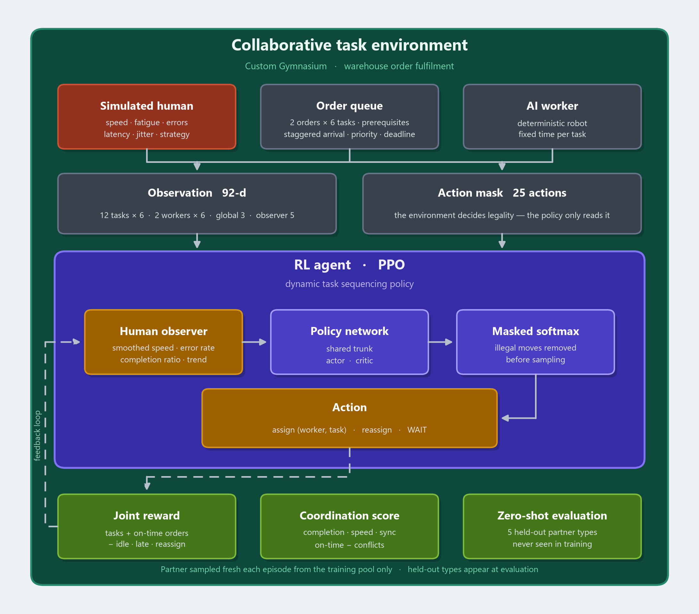
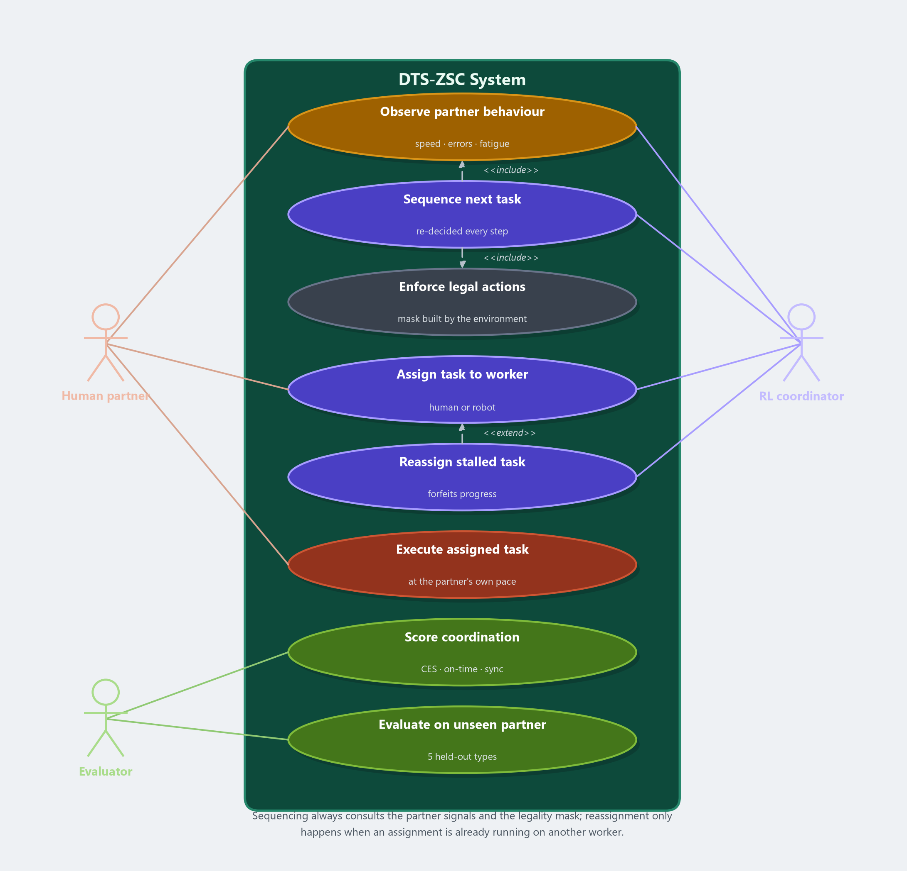
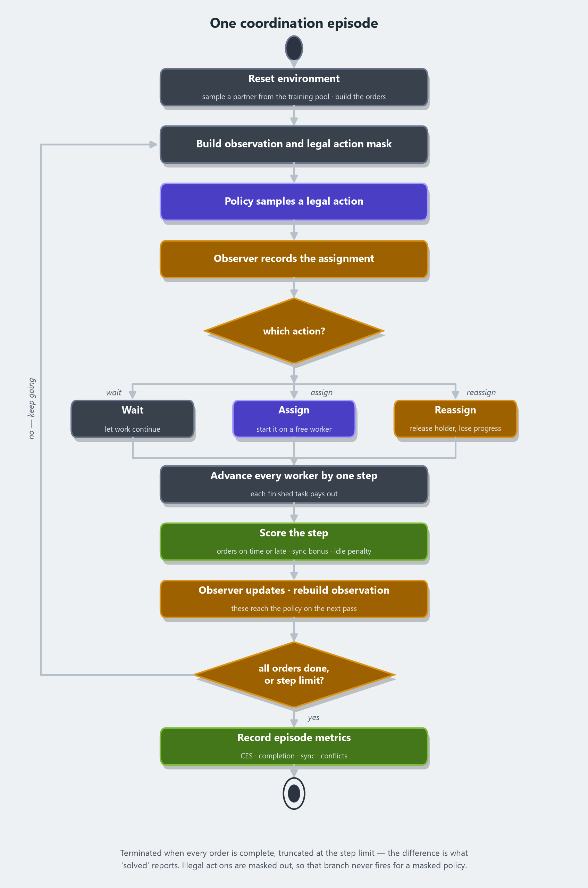

# DTS-ZSC — Dynamic Task Sequencing for Zero-Shot Human–AI Coordination

A reinforcement-learning framework in which an AI agent dynamically decides
**which warehouse task to do next** and **whether it or a human partner should
do it** — and does so with human partners it has never encountered during
training.

Coordination is modelled as a sequential decision problem. Rather than
following a predefined schedule or a learned model of one specific person, the
agent reads *generalised interaction signals* (how fast this partner is
responding, how reliable they are, how tired they seem) and re-plans on every
step.



**Who does what** — the actors and the cases they take part in:



**One episode, step by step** — the loop the agent runs until the orders are
finished or the step limit is reached:



Regenerate all three with `python scripts/make_diagrams.py`, or one at a time
with `--only architecture|usecase|activity`.

---

## 1. Quick start

```bash
python -m venv .venv
.venv\Scripts\activate            # Windows
# source .venv/bin/activate       # macOS / Linux

pip install -r requirements.txt

python train.py                                                  # ~25 min on CPU
python evaluate.py --checkpoint checkpoints/agent_final.pt --baselines
python plot_training.py                                          # charts -> results/
python app.py                                                    # dashboard -> localhost:5000
```

Every script runs from the project root and takes `--help`.

For an inventory of everything in the repository — what each file is for, the
results, and how they were verified — see
[`docs/WHAT_WAS_BUILT.md`](docs/WHAT_WAS_BUILT.md).

---

## 2. The problem

### 2.1 The order template

Each fulfilment order is a six-task dependency graph:

```
      pick_item ─────┐
                     ├──▶ pack_box ──▶ label_box ──▶ weigh_box ──▶ dispatch
      fetch_box ─────┘
```

Task durations are tuned so that no worker dominates:

| Task | Difficulty | Human (baseline) | AI | Who is naturally faster |
|---|---|---|---|---|
| pick_item | 0.3 | 4.0 | 3.5 | a fast/expert human beats the AI |
| fetch_box | 0.4 | 5.0 | 4.0 | a fast/expert human beats the AI |
| pack_box | 0.6 | 8.0 | 5.5 | the AI — precision work |
| label_box | 0.2 | 2.0 | 2.0 | even |
| weigh_box | 0.2 | 2.0 | 1.5 | the AI, slightly |
| dispatch | 0.3 | 3.0 | 2.5 | the AI, slightly |

Because the answer genuinely depends on *who the partner is*, allocation is a
real decision rather than a fixed lookup.

### 2.2 Concurrent orders, urgency and deadlines

Several orders are live at once. They **arrive at different steps**, each with
its own priority (0.2–1.0) and a deadline that tightens as priority rises. The
agent must therefore interleave orders, not just finish one before starting the
next, and it is rewarded for delivering urgent orders on time.

### 2.3 Workers

One deterministic AI robot and one simulated human by default; both are
configurable. Every worker implements the same interface (`env/workers.py`), so
adding a second robot or a third human requires no change to the reward, the
action mask or the policy.

---

## 3. The MDP

**Action space** — `Discrete(num_workers * num_tasks + 1)`

```
action  <  num_workers * num_tasks     give task (action % num_tasks)
                                       to worker (action // num_tasks)
action == num_workers * num_tasks      WAIT — let work in progress continue
```

The WAIT action matters: without it an agent must issue an assignment every
step and is punished for situations it cannot control.

An assignment action does one of two things depending on the task's state:

* **start** it, if the task is pending and its prerequisites are met, or
* **reassign** it, if the task is already in progress with a *different*
  worker — that worker is released and the work done so far is forfeited.

So the agent can prioritise, defer *and* reassign. Reassignment is charged in
proportion to the progress thrown away, which makes bailing out of a bad
assignment cheap early and expensive late. Disable it with
`--no_reassignment` to ablate the capability.

**Observation** — a flat vector

| Block | Per item | Contents |
|---|---|---|
| per task | 6 | status, difficulty, assignee, order priority, slack to deadline, arrived |
| per worker | 6 | busy, waiting-to-start, progress, observed speed, observed error rate, fatigue |
| global | 3 | elapsed-time ratio, fraction of tasks done, fraction of orders done |
| per human (observer) | 5 | smoothed speed, smoothed error rate, completion ratio, speed trend, workload |

Default configuration (2 orders, 1 AI + 1 human): **92 dimensions, 25 actions.**

**Reward**

| Term | Value |
|---|---|
| time penalty | −0.02 per step |
| task completed | +10 × difficulty |
| order completed on time | +20 × (1 + priority) |
| order completed late | +20 × 0.4 |
| order past its deadline | −0.25 × priority per step |
| worker idle **while eligible work exists** | −0.30 per worker per step |
| two or more workers busy | +0.40 per extra busy worker per step |
| reassigning a task | −2.0 × the fraction of progress forfeited |
| illegal action | −1.0 (masked out in practice) |
| all orders complete | +25 |

The idle penalty is *conditional*: waiting while the team is genuinely blocked
is free. This is what makes WAIT usable.

**Action masking.** Legality is computed by the environment
(`env.legal_action_mask()`) and published in `info["action_mask"]`. The agent
reads it rather than re-deriving it, so the policy and the environment cannot
disagree about what is legal. A test asserts this by brute force across every
action in every state.

---

## 4. The zero-shot protocol

The agent is trained **only** on `TRAIN_PROFILES`. `TEST_PROFILES` are held out
entirely and are never sampled during training — an assertion in the test suite
verifies this over 200 resets.

| Split | Profile | Speed | Error | Fatigue | Latency | Jitter | Strategy |
|---|---|---|---|---|---|---|---|
| **seen** | average | 1.00 | 0.05 | 0.010 | 0 | 0.10 | sequential |
| **seen** | fast | 0.65 | 0.07 | 0.012 | 0 | 0.15 | sequential |
| **seen** | slow | 1.60 | 0.04 | 0.008 | 1 | 0.10 | sequential |
| **seen** | expert | 0.45 | 0.01 | 0.003 | 0 | 0.05 | sequential |
| **seen** | novice | 2.40 | 0.28 | 0.030 | 2 | 0.25 | sequential |
| **held out** | tired | 1.40 | 0.14 | 0.028 | 1 | 0.18 | sequential |
| **held out** | easy_first | 1.00 | 0.05 | 0.010 | 0 | 0.10 | **easy_first** |
| **held out** | hard_first | 1.00 | 0.05 | 0.010 | 0 | 0.10 | **hard_first** |
| **held out** | hesitant | 0.90 | 0.06 | 0.012 | **3** | 0.12 | sequential |
| **held out** | erratic | 1.10 | 0.20 | 0.020 | 1 | **0.40** | sequential |

Each behavioural axis is real and observable only through its consequences:

* **speed / error / fatigue** — how long tasks actually take.
* **response latency** — the worker accepts a task but does not start for
  *n* steps. This is the "delayed response" behaviour.
* **speed jitter** — per-task random variation; an erratic worker.
* **strategy** — difficulty biases pace. An `easy_first` worker is quick on
  easy tasks and slow on hard ones; `hard_first` is the reverse. The agent has
  never seen *any* strategy bias during training, so this is a genuinely novel
  axis at test time.

The agent never observes the profile. It only sees the abstraction layer's
signals, which is what allows the policy to transfer.

---

## 5. Metrics

**Coordination Efficiency Score**

```
CES = 0.35 * completion_rate      tasks_completed / total_tasks
    + 0.20 * speed_score          1 - completion_time / max_steps
    + 0.15 * sync_score           steps with 2+ workers busy / steps
    + 0.20 * on_time_rate         orders delivered before deadline / orders
    - 0.10 * conflict_rate        illegal actions / steps
```

CES lies in [−0.10, 0.90]; higher is better. Every input is read from what the
environment actually reports, never inferred.

**Zero-shot generalisation gap** = mean CES on seen partners − mean CES on
held-out partners. A gap near zero means the agent coordinates with an
unfamiliar partner about as well as with a familiar one.

**Confidence intervals and significance.** Every policy is evaluated on the
same episode seeds, so episode *i* is the same warehouse and the same partner
for all of them. Comparisons are therefore **paired**, and `utils/stats.py`
reports:

* a percentile bootstrap 95% interval on each policy's mean CES, and
* a paired bootstrap test of the difference against the learned policy, with a
  two-sided p-value.

A difference whose interval straddles zero is not claimed. This matters most
for the margin over the greedy heuristic, which is small enough that "is that
real?" is a fair question.

---

## 6. Baselines

`evaluate.py --baselines` runs three scripted policies on the identical
environment and seeds. All three see the same information as the RL agent and
none may take an illegal action.

| Policy | Behaviour |
|---|---|
| `static` | Predefined task sequence, round-robin worker assignment, no adaptation — the "traditional static workflow" this project argues against. |
| `greedy` | A strong hand-written heuristic: most urgent task first, given to whichever free worker is estimated (from observable speed alone) to finish soonest. It will also rescue an early-stage task from a slower worker. |
| `random` | Uniform over legal actions — the floor. |

The abstract names a second traditional approach — "behavioral models trained
using historical interaction data". That is a **specialist**: an agent trained
on one partner and nothing else. Train and compare one with

```bash
python train.py --train_profiles average --total_steps 250000 \
                --save_dir checkpoints/specialist_average
python evaluate.py --checkpoint checkpoints/agent_final.pt --baselines \
       --compare specialist=checkpoints/specialist_average/agent_final.pt
```

`train.py` refuses to train on a held-out profile, so a specialist can never
be built out of the zero-shot test set by accident.

---

## 7. Ablation study

Beating baselines shows the system works; an ablation shows *which parts of it
are doing the work*. Each arm is trained on an identical budget and seed with
one component changed, then evaluated on identical episodes:

```bash
python train.py --total_steps 250000 --seed 42 --save_dir ablations/full
python train.py --total_steps 250000 --seed 42 --no_reassignment  --save_dir ablations/no_reassignment
python train.py --total_steps 250000 --seed 42 --no_observer      --save_dir ablations/no_observer
python train.py --total_steps 250000 --seed 42 --curriculum       --save_dir ablations/curriculum

python ablation.py            # paired comparison of every arm against `full`
```

| Arm | What changes |
|---|---|
| `full` | reference — every component enabled |
| `no_reassignment` | the agent may start and defer but never take a task off a worker |
| `no_observer` | the abstraction layer is blanked to zeros. The observation dimension is unchanged, so this isolates the *information*, not the network size |
| `blind_partner` | also zeros the per-worker capability signals, so the agent sees who is free but nothing about how well they work |
| `curriculum` | partners are sampled weighted towards the ones the agent is currently worst at, instead of uniformly |

### What it found

40 episodes per partner per arm, paired against `full`:

| Arm | CES | 95% CI | vs `full` | p |
|---|---|---|---|---|
| curriculum | 0.697 | [0.692, 0.701] | +0.0153 | 0.0001 |
| blind partner | 0.691 | [0.684, 0.697] | +0.0091 | 0.0001 |
| no observer | 0.688 | [0.681, 0.695] | +0.0066 | 0.0006 |
| full | 0.682 | [0.674, 0.689] | — | — |
| no reassignment | 0.679 | [0.669, 0.689] | −0.0023 | 0.61 |

**Curriculum sampling helps** and is the only change that improves every hard
partner at once (novice 0.598 → 0.625, tired 0.600 → 0.669), reaching 100%
solved and 92% on time.

**Reassignment shows no overall effect, but the mean hides it.** On the novice
partner it is decisive — 0.598 with it against 0.428 without — and it flips the
zero-shot gap from −0.035 to +0.009. It earns its place on the hard cases and
costs nothing elsewhere, which matches the agent using it selectively (one
takeover per episode with a novice, none with an expert).

**Removing the partner signals slightly *helps*.** This is a negative result
for the abstraction layer and it reproduces at both strengths: blanking the
smoothed summary gains +0.007, and blanking the raw capability signals as well
gains +0.009. The adaptation itself is unaffected — a blind agent still
delegates 41.7% of the work to an expert and 8.8% to a novice, almost exactly
the full agent's 41.7% / 8.3%.

The mechanism is that partner capability is already implicit in the scheduling
state: a slower worker simply stays `busy` for more steps, so the policy can
read speed from the timing of state transitions without an explicit feature.
The explicit signals are redundant, and the five extra dimensions appear to cost
a little in sample efficiency. Novelty 5 delivers the *behaviour* it claims —
generalised signals rather than partner profiling — but this environment does
not show the dedicated feature block to be necessary for it.

**Caveat on all of the above:** each arm is one training run at one seed, and
the intervals are over evaluation episodes, not over seeds. They quantify how
reliably *these* policies differ, not how reliably the *components* differ.
Separating those would need several seeds per arm.

Two details make the comparison honest, and both are read from the config each
checkpoint records at save time:

* an observer-ablated agent is evaluated with the observer blanked, because it
  never learned to read that feature block;
* a reassignment-ablated agent is evaluated in an environment where
  reassignment is also forbidden, because it never learned those actions exist.

### The curriculum, and why it has a floor

Weighting towards weak partners is a softmax over negative CES. Left
unconstrained it collapses: at temperature 0.15 the weakest partner takes 64%
of all episodes and the agent regresses on everyone else — the failure mode
reported in the curriculum-design literature. Two guards prevent it:

* a **warm-up**, during which sampling stays uniform, and
* a **floor** on every partner's probability (default 40% of uniform), so a
  mastered partner still appears and cannot be forgotten.

At the default temperature of 0.35 the weakest partner gets roughly twice its
uniform share rather than three times it.

---

## 8. Project structure

```
env/
  task_definitions.py   order template, TaskSpec, Order (deadlines, priority, slack)
  workers.py            AIWorker + the shared worker protocol
  collaborative_env.py  the Gymnasium environment, reward and action mask
human/
  simulated_human.py    HumanProfile, SimulatedHuman, the train/test split
agent/
  ppo_agent.py          network, rollout buffer, PPO update
  human_observer.py     Human Interaction Abstraction Layer
  curriculum.py         partner sampling weighted towards weak partners
utils/
  metrics.py            EpisodeStats, CES, per-profile table, ZSC report
  episode.py            EpisodeTracker — one place statistics are assembled
  runner.py             shared episode / evaluation loop
  stats.py              bootstrap intervals and paired significance tests
  analytics.py          Performance Analytics Module (all charts)
train.py                training entry point
evaluate.py             evaluation, zero-shot report, baselines, significance
ablation.py             component study across matched training arms
baselines.py            static / greedy / random policies
plot_training.py        CLI for the analytics module
app.py                  interactive coordination dashboard (Flask)
tests/test_dts_zsc.py   correctness tests
```

---

## 9. The dashboard

See the illustrated [dashboard UI guide](docs/UI_GUIDE.md) for the meaning and
purpose of every control, metric, workflow state, explanation, and research
panel. A screenshot-embedded [WordPad version](docs/UI_GUIDE.rtf) is also
available.

`python app.py` → <http://localhost:5000>

* **Task dependency graph** per order, rendered as a live SVG DAG. Nodes are
  coloured by status and by who is working on them; edges turn green as
  prerequisites are satisfied; each node carries its own progress bar.
* **Order panels** with priority, deadline and remaining slack.
* **Worker panels** with human vitals (speed, fatigue, error rate).
* **Metric cards** — reward, CES, tasks done, sync steps, conflicts.
* **Event log** narrating the agent's actual decisions.
* **Policy selector** — watch the PPO agent and each baseline drive the same
  scenario, which makes the difference between learned sequencing and a fixed
  workflow directly visible.
* **Partner selector** — held-out profiles are labelled "zero-shot".
* **Scenario selector** — 1–6 orders, up to 2 AI + 2 humans. The step budget
  follows the workload: 70 ticks for two orders, 90 for three, then 35 more
  for every order beyond the third.
* **Order priority** — the presets pin every order to the same urgency, or
  "Custom sequence" lets the operator rank the orders by hand. Click the
  orders in the sequence you want them worked (for example 1, 2, 3, 6, 5, 4)
  and rank #1 receives the highest urgency and the tightest deadline, with the
  rest spaced evenly down to the lowest. Orders still arrive on their own
  schedule, so a ranking cannot start an order before it exists.

Selecting a scenario the checkpoint was not trained on falls back to an
untrained agent and says so in a banner rather than failing.

---

## 10. Scaling

The environment is parameterised, so the framework extends to larger
warehouses without code changes:

```bash
python train.py --num_orders 3 --num_humans 2 --num_ai 2 --max_steps 90
```

Observation and action dimensions are derived by `obs_dim_for()` and
`action_dim_for()`; checkpoints record the shape they were trained with and
refuse to load into a mismatched configuration.

---

## 11. Tests

```bash
python tests/test_dts_zsc.py
```

Covers observation/action shapes, exhaustive mask-vs-environment agreement,
WAIT legality, the train/test profile split, profile distinctness, the PPO
update, checkpoint round-trips, metric arithmetic, and the dashboard API.

---

## 12. Technologies

Python · PyTorch · NumPy · Gymnasium · Pandas · TQDM · Matplotlib · Flask
