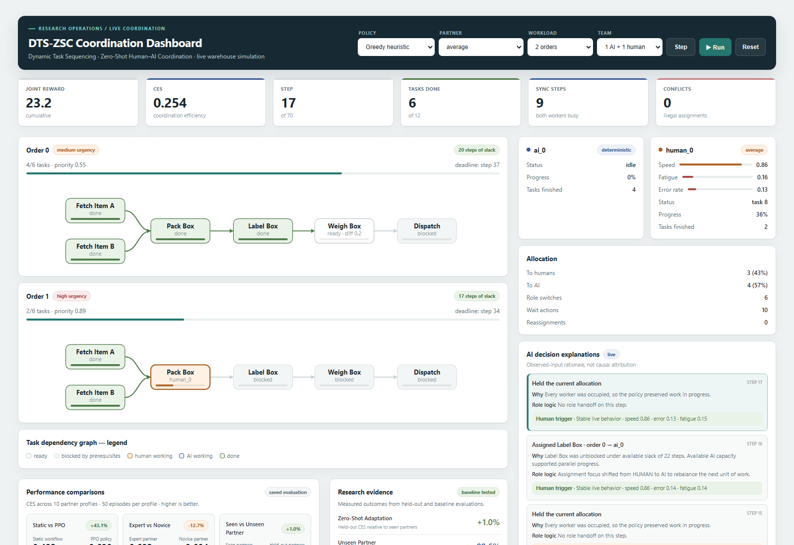
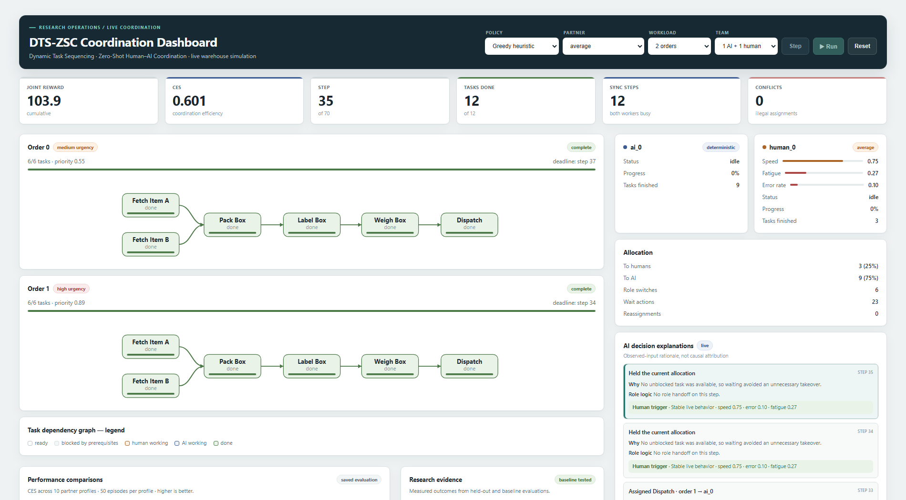
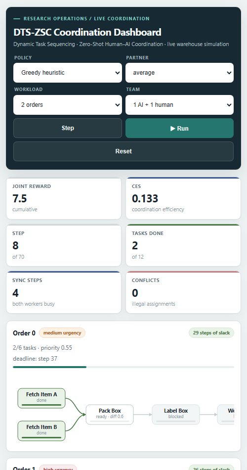

# DTS-ZSC Coordination Dashboard: UI Guide

This guide explains what every part of the dashboard means, why it is present, and how to read the interface while a warehouse coordination episode is running.

The screenshots below were captured from the current application using the **Greedy heuristic**, the **average** human-partner profile, **2 orders**, and a **1 AI + 1 human** team. They illustrate the interface rather than a claim about PPO performance. The comparison and research panels use saved evaluation data and do not change when the live policy selector changes.

## 1. Dashboard at a glance



*Running desktop state. The live episode occupies the left side; worker state and decision context stay visible in the right rail. The lower panels contain saved evaluation evidence.*

The page is organized into five levels:

1. **Scenario controls** define the policy, partner, workload, and team.
2. **Episode metrics** summarize the current run.
3. **Order workflow cards** show what work is ready, active, blocked, or complete.
4. **Worker and explanation panels** show who is doing the work and the context behind coordinator decisions.
5. **Evaluation panels** put the live demonstration in the context of repeatable research results.

This hierarchy is intentional: the most frequently used controls and live state are at the top, detailed operational context is beside the workflow, and slower-changing research evidence is below it.

## 2. Header and scenario controls

The dark header visually separates experiment configuration from simulation results. Every selector has a permanent label so its meaning remains visible after a value is chosen.

| Element | What it means | Why it is in the UI |
| --- | --- | --- |
| **Policy** | Chooses the coordinator: PPO, Greedy, Static, or Random. | Makes learned and baseline behavior observable under the same type of scenario. |
| **Partner** | Chooses a simulated human behavior profile. Profiles are grouped as seen during training or held-out. | Lets a researcher inspect adaptation to different human speeds, fatigue, and error patterns. |
| **Workload** | Selects one, two, or three orders. | Changes task volume and deadline pressure without changing the page structure. |
| **Team** | Selects 1 AI + 1 human, 1 AI + 2 humans, or 2 AI + 2 humans. | Exposes coordination behavior at different team sizes. |
| **Step** | Advances the environment by one decision tick. | Supports slow, inspectable debugging and demonstrations. |
| **Run / Pause** | Automatically advances the environment or pauses it at the current step. | Supports continuous playback without removing manual control. |
| **Reset** | Starts a new episode using the selected configuration. | Applies selector changes and returns the simulation to a known initial state. |

### Policy meanings

| Policy | Behavior |
| --- | --- |
| **PPO agent (learned)** | Uses the trained reinforcement-learning policy when a compatible checkpoint is available. |
| **Greedy heuristic** | Ranks ready tasks by urgency and dependency value, then selects the free worker with the best estimated completion time from observable signals. |
| **Static workflow** | Follows a fixed task order and round-robin assignment. It does not adapt to the current partner. |
| **Random baseline** | Selects uniformly from currently legal actions and represents a lower-bound baseline. |

All policies receive the same legality mask. Illegal actions therefore fall back to waiting rather than giving one policy an unfair conflict penalty.

### Button states

- The primary **Run** button uses teal because it starts the main action.
- **Step** is quieter because it is a secondary, deliberate action.
- **Reset** is outlined to distinguish restarting from advancing.
- Step and Run become visibly disabled when an episode finishes or reaches its step limit. A disabled button is unavailable, not missing.

## 3. Live episode metrics

The six cards under the header provide a single-row health check on large screens and reflow into smaller grids on narrow screens.

| Metric | Definition | How to read it |
| --- | --- | --- |
| **Joint reward** | Cumulative environment reward earned by the team in the current episode. | Higher is generally better, but use CES for a normalized coordination comparison. |
| **CES** | Coordination Efficiency Score calculated from task completion, speed, synchronization, on-time orders, and conflicts. | Higher is better. The implemented theoretical range is -0.10 to 0.90. |
| **Step** | Current simulation step out of the maximum allowed steps. | Shows how much of the episode time budget has been consumed. |
| **Tasks done** | Completed tasks out of all tasks across all orders. | Direct measure of work completed. Each order contains six tasks. |
| **Sync steps** | Steps during which at least two workers were busy. | Indicates parallel human-AI activity rather than sequential work. |
| **Conflicts** | Illegal assignment attempts recorded by the environment. | Lower is better. The action mask normally keeps this at zero. |

The CES formula is:

```text
CES = 0.35 x completion rate
    + 0.20 x speed score
    + 0.15 x synchronization score
    + 0.20 x on-time order rate
    - 0.10 x conflict rate
```

CES is shown as **Pending** before the first step because there is not yet meaningful episode activity to score.

## 4. Order cards and completion line

Each order card is a compact operational view of one six-task order.

### Order header

| Element | Meaning |
| --- | --- |
| **Order number** | Stable identifier for the order. |
| **Urgency tag** | Human-readable category derived from the order priority. Red indicates high urgency; amber indicates medium urgency. |
| **`x/6 tasks`** | Number of completed tasks in this order. |
| **Priority** | Numeric weight used by policies and the environment to represent importance. |
| **Slack / complete tag** | Remaining time before the deadline, or a completed state. |
| **Deadline** | Step by which the order should be completed. |

### The long line is task completion, not deadline progress

The line directly below `x/6 tasks` fills **from left to right** as tasks complete:

- `0/6` = 0% filled
- `3/6` = 50% filled
- `6/6` = 100% filled

Teal means active progress, green means the order is complete, and red means the order is still unfinished after its deadline. The deadline text on the right is a reference value; it is not a second bar and does not fill in the opposite direction.

This separation prevents two different concepts from being mixed: **completion** answers “how much work is finished?”, while **deadline/slack** answers “how much time remains?”

## 5. Task dependency graph

Every order follows this dependency sequence:

```text
Pick Item ------\
                  > Pack Box -> Label Box -> Weigh Box -> Dispatch
Fetch Box ------/
```

Pick Item and Fetch Box can begin independently. Packing becomes available only after both are complete; the remaining tasks then unlock in sequence. Arrows make these prerequisites explicit, and an arrow turns green after its upstream dependency has been satisfied.

### Task-node states

| Appearance | Meaning | Why this color is used |
| --- | --- | --- |
| White with neutral outline | Ready to be assigned. | High contrast without implying ownership. |
| Pale grey | Blocked by prerequisites. | Visually recedes until it becomes actionable. |
| Ochre / amber | A human is working on the task. | Matches the human identity color used in worker cards. |
| Indigo | An AI worker is working on the task. | Matches the AI identity color used throughout the page. |
| Pale green | Task is complete. | Consistent success/completion signal. |

The small label inside a node shows its current state: `ready`, `blocked`, the assigned worker name, `starting`, or `done`. The thin inner line at the bottom of a node is that task's own execution progress; it is different from the full-order completion line above the graph.

The fetch nodes are the same visual scale as the downstream tasks. On small screens, the graph keeps a readable minimum width and can be scrolled horizontally instead of shrinking the labels until they become unreadable.

## 6. Worker cards

Worker cards answer two questions: **who is available?** and **what is their current operating condition?**

### AI worker

- Indigo dot identifies AI consistently with indigo task nodes.
- **Status** reports idle or active task state.
- **Progress** reports completion of the AI worker's current task.
- **Tasks finished** is the worker's completed-task count.
- The profile badge indicates deterministic AI operation in the live demonstration.

### Human worker

- Ochre dot identifies a human consistently with ochre task nodes.
- **Speed** is the observed normalized working pace; `1.00` is baseline speed or faster.
- **Fatigue** is a normalized value from 0 to 1.
- **Error rate** is the recently observed error frequency.
- **Status**, **Progress**, and **Tasks finished** have the same meanings as on the AI card.
- A red **zero-shot** tag means this partner profile was held out from training.

The horizontal tracks make human behavior signals scannable without requiring readers to compare several decimal values mentally. The numeric values remain visible for exact interpretation.

## 7. Allocation summary

The allocation card summarizes coordination behavior over the current episode.

| Field | Meaning |
| --- | --- |
| **To humans** | Accepted assignments sent to human workers, with their share of all accepted assignments. |
| **To AI** | Accepted assignments sent to AI workers, with their share. |
| **Role switches** | Changes between human and AI assignment types across accepted decisions. |
| **Wait actions** | Decisions in which no new task was assigned. Waiting can be correct when all workers are occupied or no task is unblocked. |
| **Reassignments** | In-progress tasks moved to another worker. Because takeover forfeits existing progress, a high count can indicate disruptive coordination churn. |

The allocation summary is descriptive, not a target quota. A 50/50 split is not automatically better than an adaptive split suited to the active partner and workload.

## 8. Coordinator decision explanations

The explanation panel translates each coordinator action into operational language. Newest decisions appear first, and each record includes its simulation step.

Each explanation contains:

- **Decision** — what the coordinator did, such as assigning a task, changing its holder, or maintaining the current allocation.
- **Why** — relevant task availability, timing, or worker availability at that step.
- **Role logic** — why the selected worker type or unchanged ownership made operational sense.
- **Human trigger** — observed human speed, error, fatigue, or delayed-response signals relevant to the decision context.

The panel says **“Observed-input rationale, not causal attribution”** intentionally. It explains a decision using inputs available to the coordinator; it does not claim to expose the PPO network's private internal chain of thought or prove that one input alone caused the action.

Green trigger strips indicate stable observed human behavior. Amber draws attention to fatigue, errors, or delayed responses that may affect assignment suitability.

## 9. Performance comparisons

The comparison panel contains saved evaluation results, not the single live episode. It reports CES across **10 partner profiles** and **50 episodes per profile** so the user does not mistake one animation for statistical evidence.

| Comparison | What it answers |
| --- | --- |
| **Static vs PPO** | Does the learned coordinator improve on a fixed, non-adaptive workflow? |
| **Expert vs Novice** | How does PPO performance change between a fast/expert and a slower/novice partner? |
| **Seen vs Unseen Partner** | How well does PPO transfer to held-out partner profiles without retraining? |

Each card shows both CES values as comparable bars. The percentage badge reports the **right-hand result relative to the left-hand result**. Positive and negative signs therefore describe direction, not automatically good or bad; for example, a novice score below an expert score is expected to display a negative difference.

## 10. Research evidence

The research evidence panel turns the evaluated results into five thesis-level outcomes.

| Evidence item | Definition |
| --- | --- |
| **Zero-Shot Adaptation** | Held-out-partner CES relative to seen-partner CES. |
| **Unseen Partner** | Solve rate across the held-out-partner episodes, without retraining. |
| **Coordination Improvement** | Overall PPO CES relative to the static baseline. |
| **Idle Time Reduction** | Change in the fully idle step rate versus Static, measured across 500 episodes per policy. A negative displayed change means fewer idle steps. |
| **Conflict Reduction** | Change in disruptive in-progress task takeovers versus Random. Illegal conflicts remained zero for all legality-masked policies, so the card states this caveat explicitly. |

The values come from `results/evaluation.json` and `results/research_evidence.json`. The **saved evaluation** and **baseline tested** tags distinguish measured artifacts from live simulation state.

## 11. Completed episode



*Completed desktop state. Order bars and workflow nodes are green, while Step and Run are disabled because no further simulation action is available.*

At successful completion:

- Every order shows a green **complete** tag.
- Every order-completion line is filled fully in green.
- Every graph node is in the done state.
- Step and Run are disabled.
- The bottom status message summarizes completion step, CES, and reward.

If the maximum step count is reached first, the status uses the failure/risk treatment and reports how many tasks and orders were completed before truncation.

## 12. Responsive behavior



*Mobile state. Controls and metrics reflow into compact grids, panels stack vertically, and the dependency graph remains readable through horizontal scrolling.*

The same content is preserved at all supported widths:

- On wide desktop screens, order workflows use the main column and worker/explanation panels form a right rail.
- On medium screens, the right rail moves below the simulation instead of compressing text.
- On phones, controls and metric cards use two-column grids and secondary sections stack into one column.
- Dependency graphs retain legible nodes and use horizontal scrolling when the screen is narrower than the workflow.
- Buttons remain full-height touch targets and labels stay visible.

This is a full-width layout with a small page gutter rather than a narrow fixed-width canvas. It uses CSS Grid for page regions and Flexbox where content needs to wrap naturally.

## 13. Color and visual-language reference

| Color family | Meaning |
| --- | --- |
| Dark slate / navy | Application identity and experiment controls. |
| Teal | Primary action and live completion progress. |
| Indigo | AI identity and AI-owned work. |
| Ochre / amber | Human identity, human-owned work, or attention. |
| Green | Completed, successful, or stable state. |
| Red | High urgency, zero-shot warning, missed deadline, conflict, or failure. |
| Grey | Blocked, disabled, or secondary information. |

Color is reinforced by text, labels, percentages, and status words so it is never the only way to understand a state.

## 14. Data boundaries and interpretation

- **Live panels** — metrics, order cards, workers, allocation, explanations, and status — describe the current episode only.
- **Saved evaluation panels** — comparisons and research evidence — summarize repeated evaluation runs from result files.
- An attractive live run is a demonstration, not proof of general performance; use the evaluation panels for research claims.
- Decision explanations are contextual summaries of observable inputs, not causal model introspection.
- Conflict counts and takeover counts are distinct: a takeover may be legal but still disruptive.

## 15. Running the dashboard

From the repository root:

```bash
python app.py
```

Then open [http://localhost:5000](http://localhost:5000). Select a scenario, press **Reset** to apply it, and use **Step** for inspection or **Run** for continuous playback.

The dashboard is self-contained: its component styles, responsive rules, icons, and workflow graphics are defined within the application rather than loaded from an external UI framework or image service.
